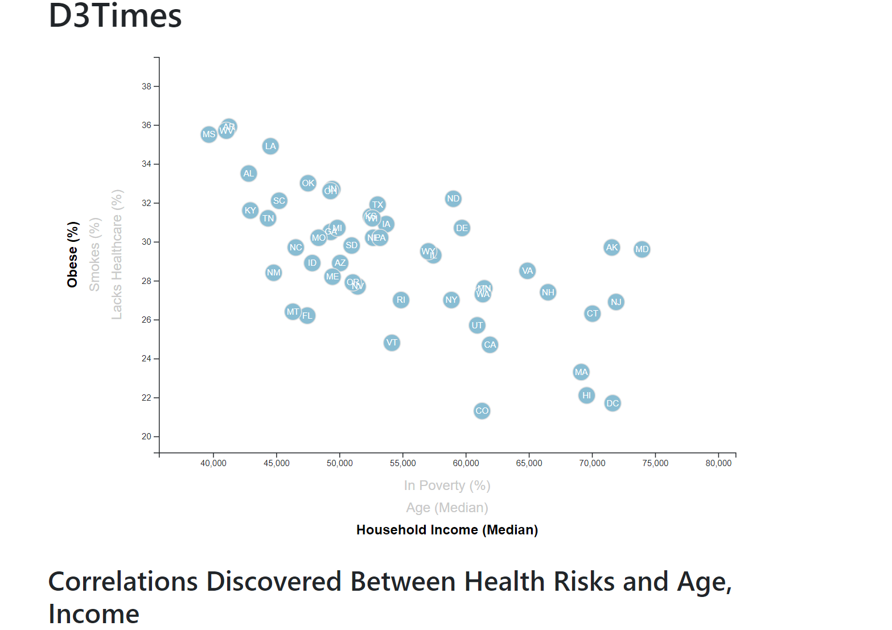
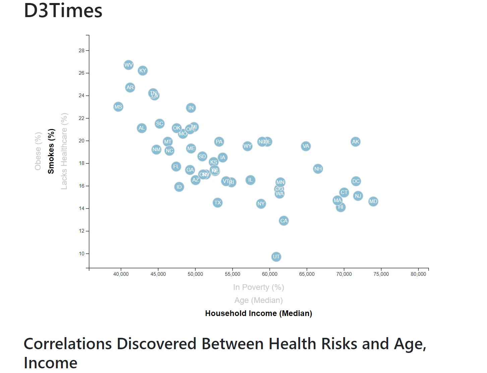
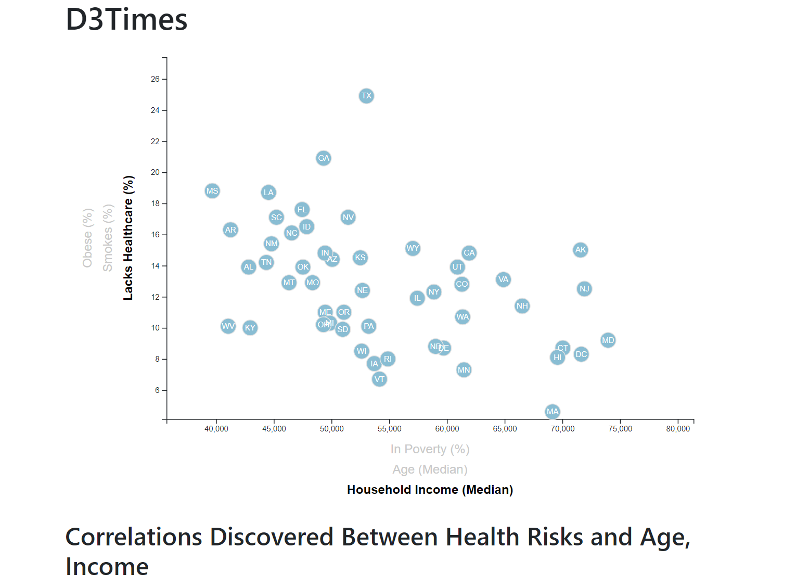
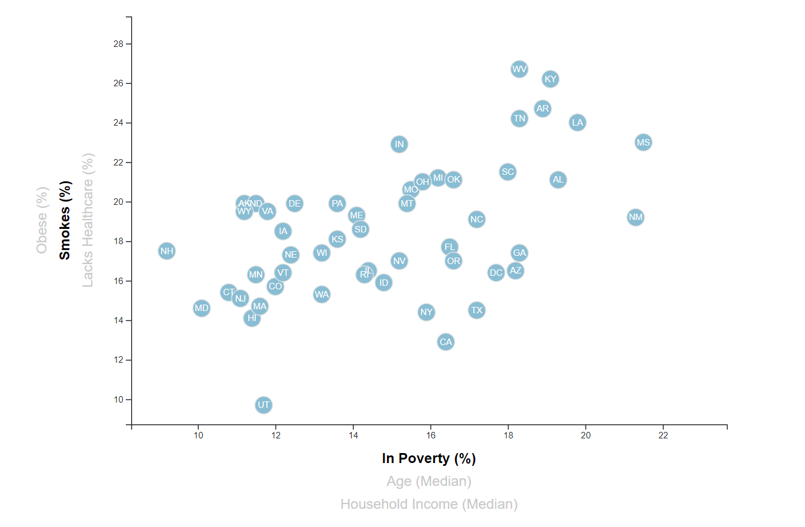
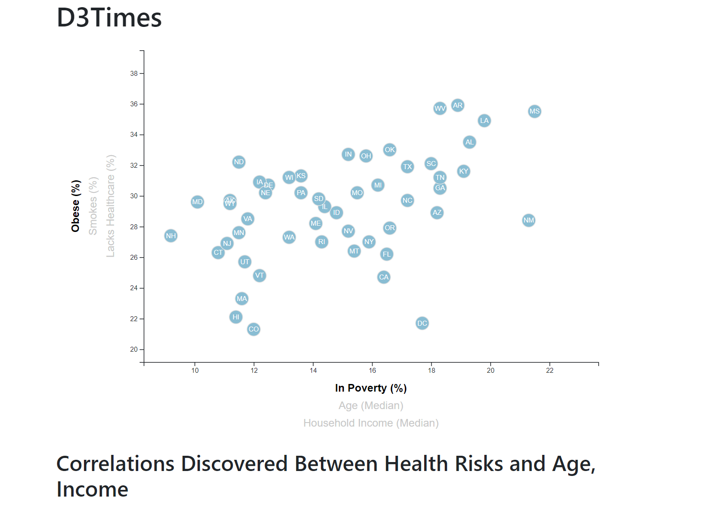
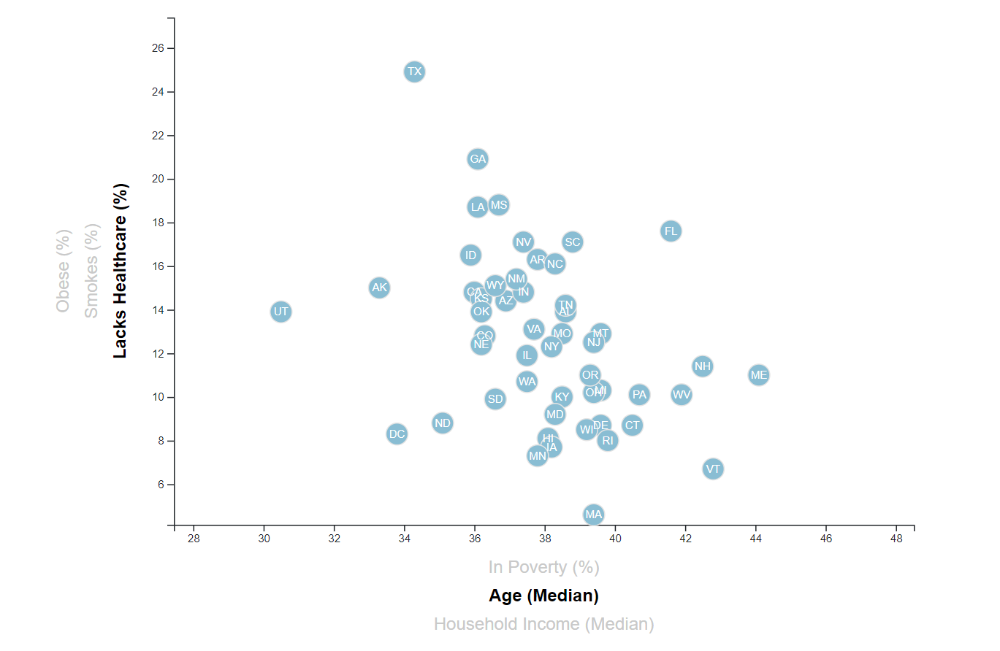
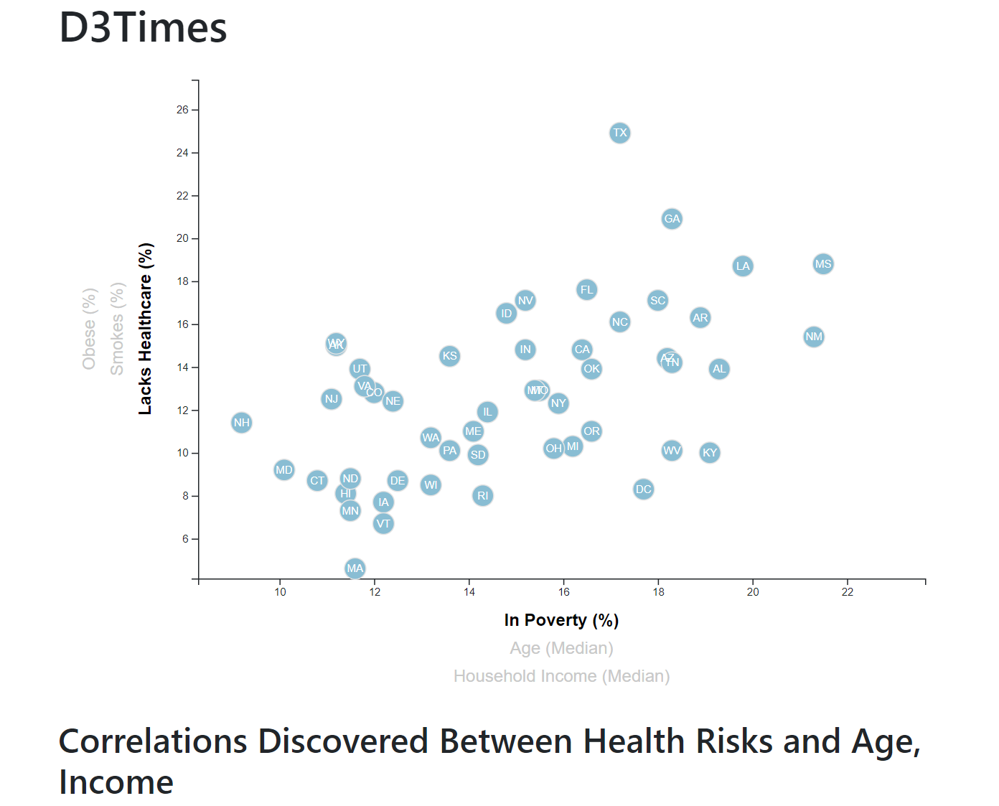

# D3-challenge: Data Journalism 

## Installation

Windows, OS X, Linux:

* IDE that supports Python and Web Development
* Python Web Server

## Usage example

### Obesity

### Smoking

### Healthcare

## Development setup

* [Python Web Server](https://pythonbasics.org/webserver/)

* [Multi-Language IDEs](https://www.keycdn.com/blog/best-ide)

## Meta

Noah Stettler – noahstettler@gmail.com

[github link](https://github.com/noahstettler)
