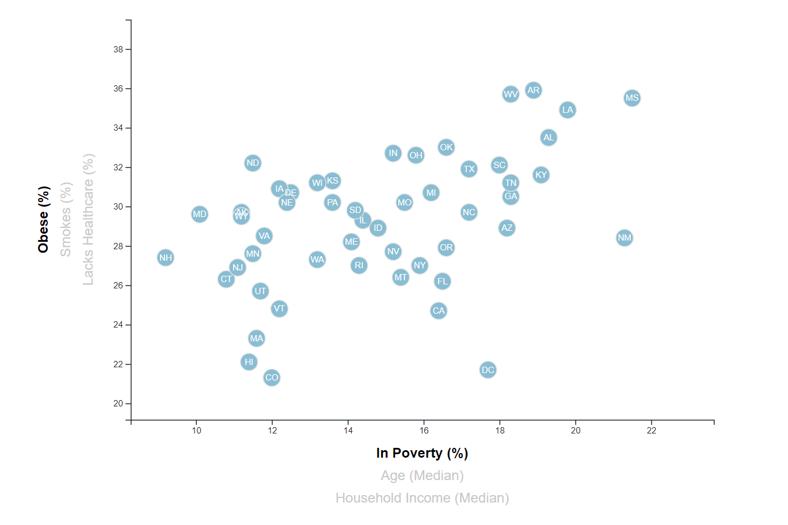
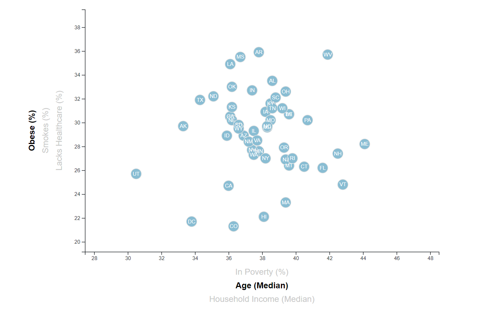
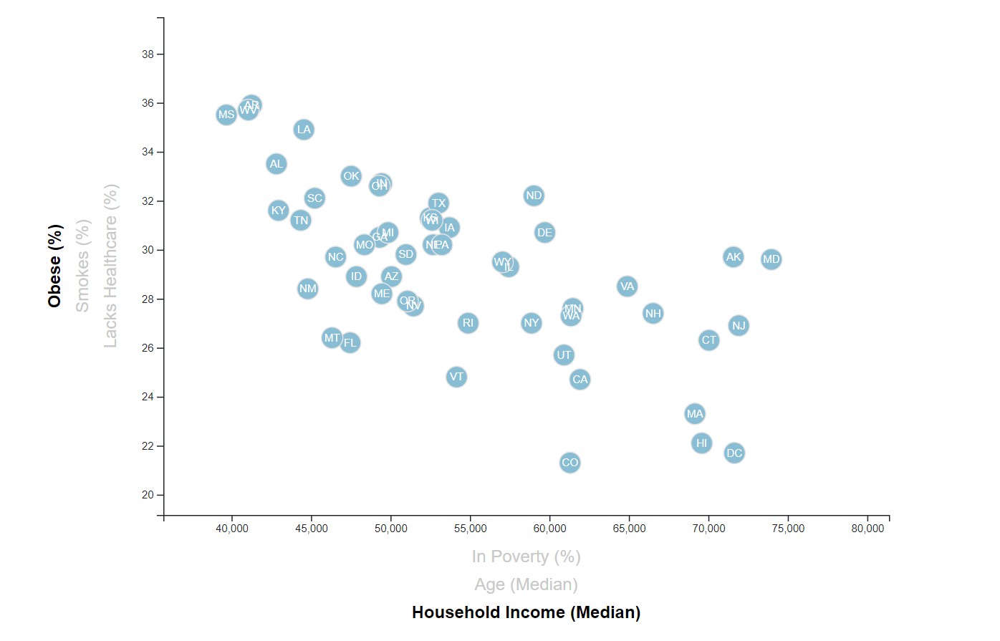
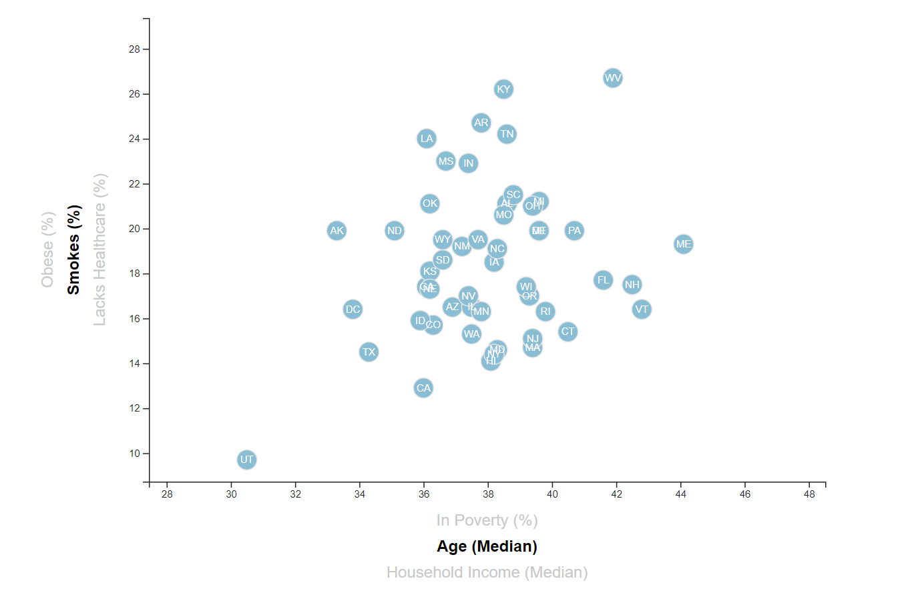
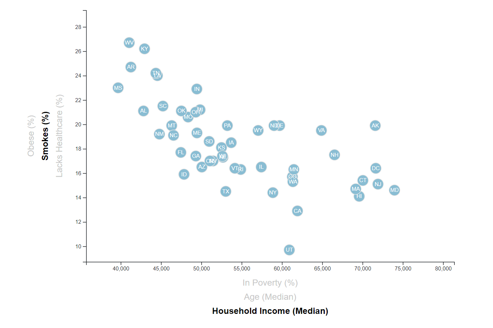
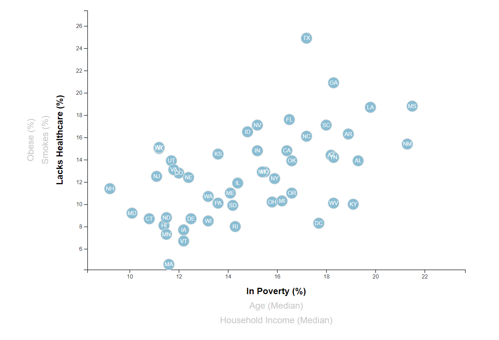
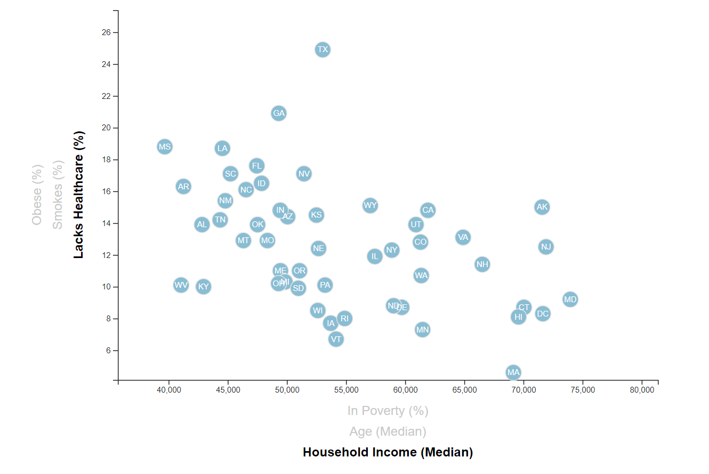

# D3-challenge: Data Journalism 
This project is a data visualization of correlations between health, income and age by state in the USA. The visualiztion is a scatter plot created using D3 techniques in JavaScript and uses a Python Web Server. The axis are intereactive and can be set by clicking on any of the following:
* X-axis: Median of Poverty, Age, or Household Income
* Y-axis: Percent total of the Obesity, Smoking, and Non-Healthcare owning State population

## Installation

Windows, OS X, Linux:

* IDE that supports Python and Web Development
* Python Web Server

## Usage example

### Obesity

### Smoking

### Healthcare

## Development setup

* [Python Web Server](https://pythonbasics.org/webserver/)

* [Multi-Language IDEs](https://www.keycdn.com/blog/best-ide)

## Meta

Noah Stettler – noahstettler@gmail.com

[github link](https://github.com/noahstettler)
